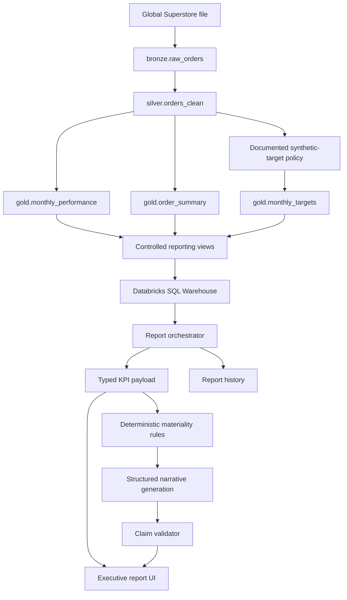

# MVP Architecture

The first deployment target is a Databricks App. Outbound access to the selected LLM provider must be tested early. If Free Edition blocks the request, the frontend and orchestration API can be hosted externally while Databricks remains the data and SQL platform.
